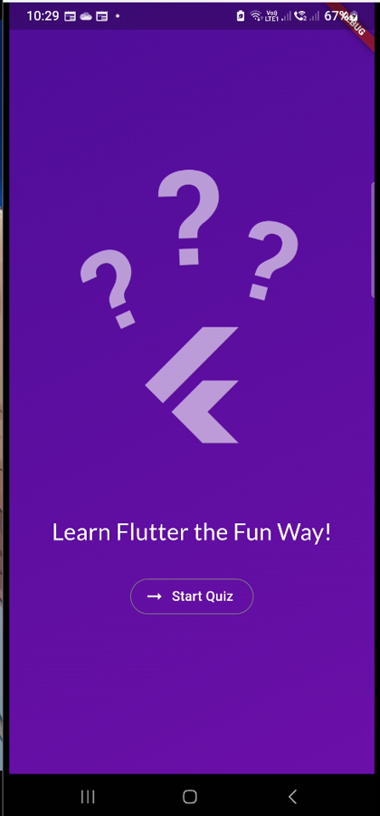
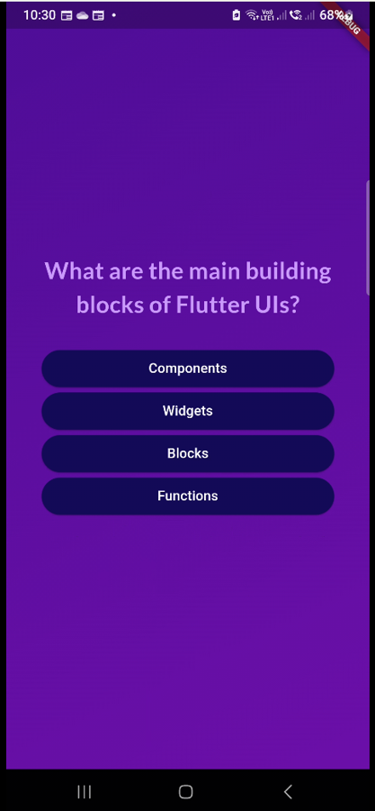
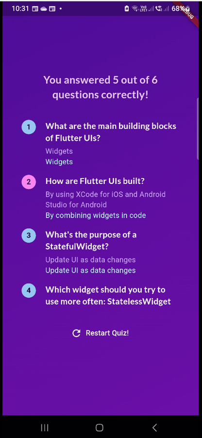

# The Quiz App
 

## About
Introduces how various different widgets can be used together to create a better UI experience for the user. 

## Images
<table>
  <tr>
    <th>Screen Name</th>
    <th>Screenshot</th>
  </tr>
  <tr>
    <td><strong>Start Screen</strong></td>
    <td></td>
  </tr>
  <tr>
    <td><strong>Question Screen</strong></td>
    <td></td>
  </tr>
  <tr>
    <td><strong>Result Screen</strong></td>
    <td></td>
  </tr>
</table>
